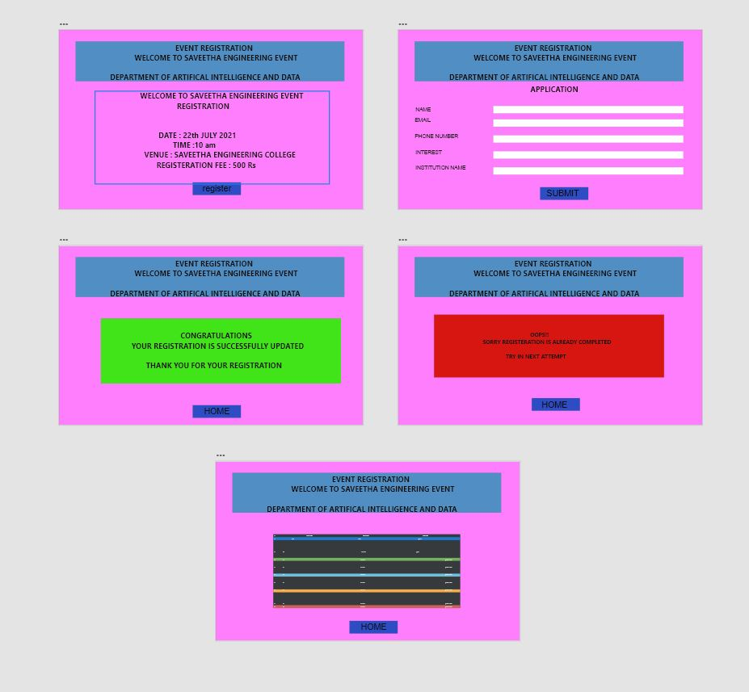
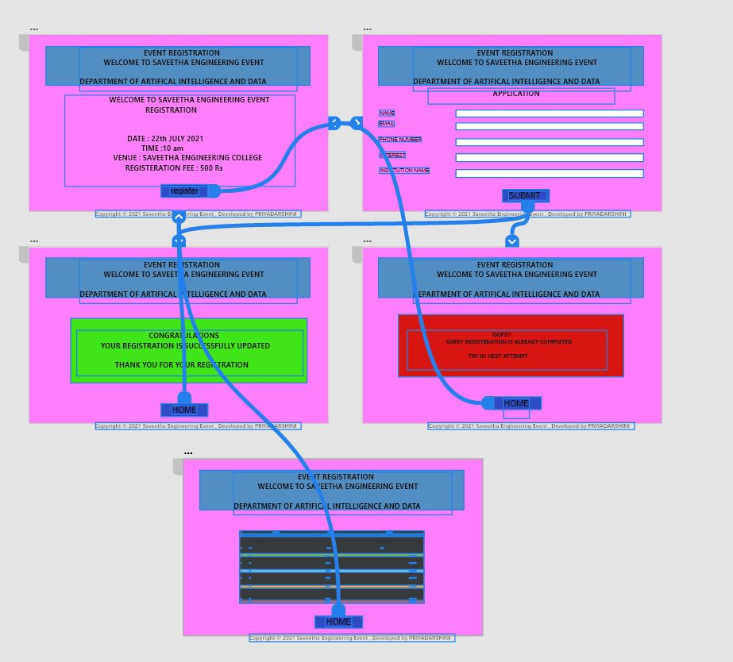
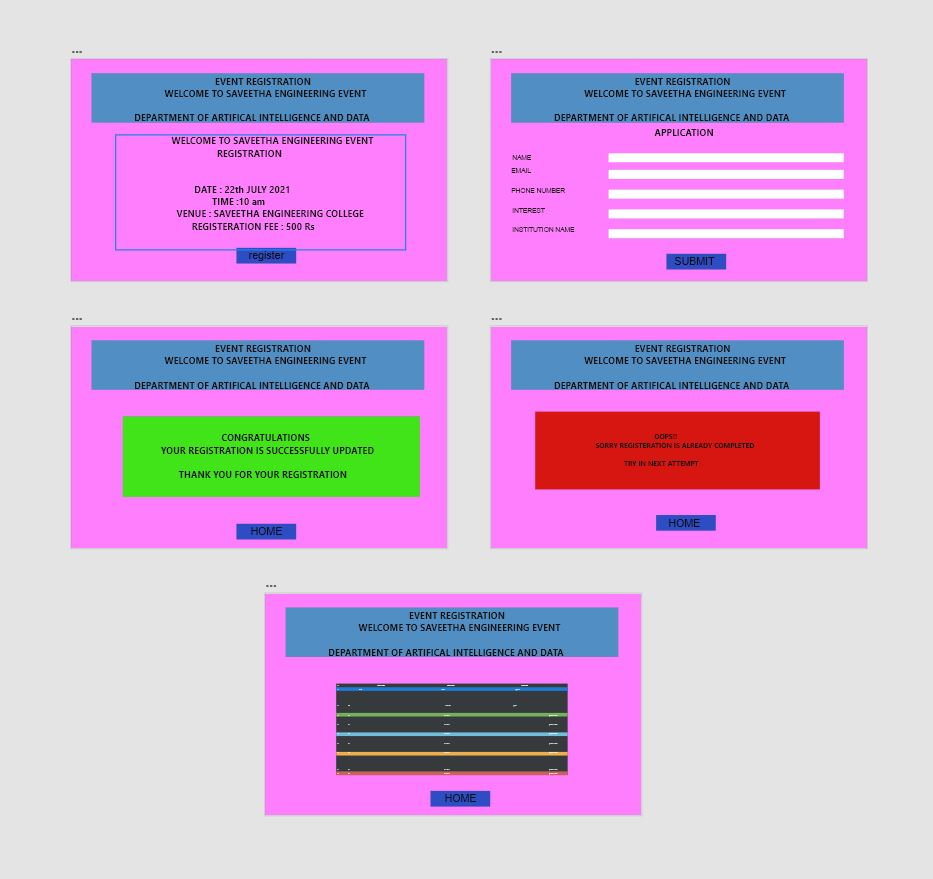
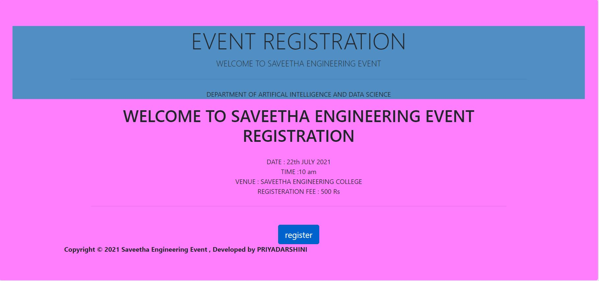
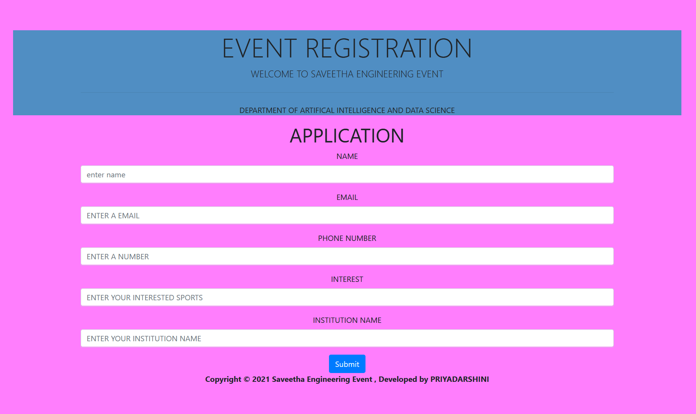
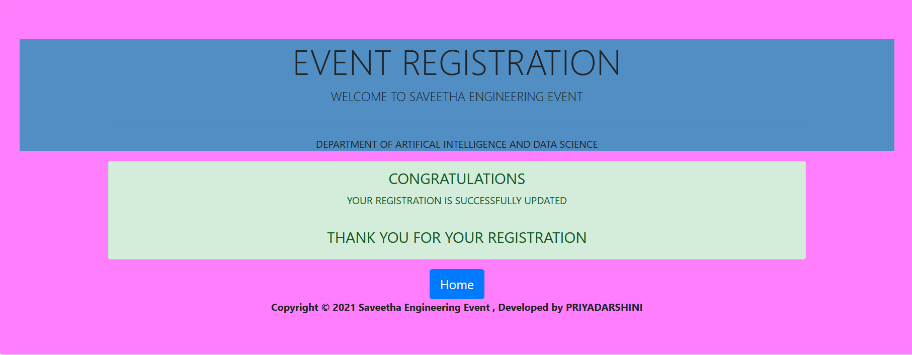
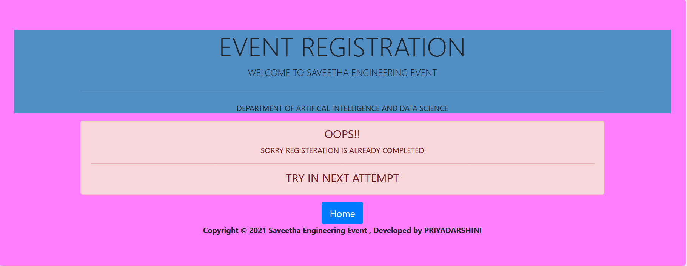

# WebApplication for Event Registration

## AIM:
To create a UX design and develop a web application for event registration.


## DESIGN SCREENS:





## WIREFRAME:





## PROTOTYPE:





## PROGRAM:

### HOME.HTML: 

```

<!doctype html>
<html lang="en">

<head>
    <!-- Required meta tags -->
    <meta charset="utf-8">
    <meta name="viewport" content="width=device-width, initial-scale=1, shrink-to-fit=no">

    <!-- Bootstrap CSS -->
    <link rel="stylesheet" href="https://maxcdn.bootstrapcdn.com/bootstrap/4.0.0/css/bootstrap.min.css"
        integrity="sha384-Gn5384xqQ1aoWXA+058RXPxPg6fy4IWvTNh0E263XmFcJlSAwiGgFAW/dAiS6JXm" crossorigin="anonymous">

    <title>SAVEETHA ENGINEERING COLLEGE</title>
</head>

<body>


    <div class="jumbotron text-center">
        <div class="jumbotron" style="background-color:#FF7EFD;">
            <div style="background-color: #508EC3;">
                <div class="container">
                    <h1 class="display-4">EVENT REGISTRATION </h1>
                    <p class="lead">WELCOME TO SAVEETHA ENGINEERING EVENT</p>
                    <hr class="my-4">
                    <p>DEPARTMENT OF ARTIFICAL INTELLIGENCE AND DATA SCIENCE</p>

                </div>
            </div>
            <div class="container">
                <div class="row">
                    <div class="col-12">
                        <h1 class="text-center"> WELCOME TO SAVEETHA ENGINEERING EVENT REGISTRATION</h1>
                        <div class="container text-center">

                            <div class="container text-center">
                                <div class="card-body">
                                    <p class="display-5"> DATE : 22th JULY 2021 <br> TIME :10 am<br>VENUE : SAVEETHA
                                        ENGINEERING COLLEGE<br>
                                        REGISTERATION FEE : 500 Rs<br> </p>
                                    <hr class="my-4">
                                    <p class="lead">
                                </div>
                                <div class="col-12 text-center">
                                    <a href="/register/" class="btn btn-primary btn-lg active"
                                        role="button">register</a>
                                </div>
                            </div>

                        </div>
                    </div>

                    <!-- Optional JavaScript -->
                    <!-- jQuery first, then Popper.js, then Bootstrap JS -->
                    <script src="https://code.jquery.com/jquery-3.2.1.slim.min.js"
                        integrity="sha384-KJ3o2DKtIkvYIK3UENzmM7KCkRr/rE9/Qpg6aAZGJwFDMVNA/GpGFF93hXpG5KkN"
                        crossorigin="anonymous"></script>
                    <script src="https://cdnjs.cloudflare.com/ajax/libs/popper.js/1.12.9/umd/popper.min.js"
                        integrity="sha384-ApNbgh9B+Y1QKtv3Rn7W3mgPxhU9K/ScQsAP7hUibX39j7fakFPskvXusvfa0b4Q"
                        crossorigin="anonymous"></script>
                    <script src="https://maxcdn.bootstrapcdn.com/bootstrap/4.0.0/js/bootstrap.min.js"
                        integrity="sha384-JZR6Spejh4U02d8jOt6vLEHfe/JQGiRRSQQxSfFWpi1MquVdAyjUar5+76PVCmYl"
                        crossorigin="anonymous"></script>

                    <div class="footer text-center">
                        <b>Copyright © 2021 Saveetha Engineering Event , Developed by PRIYADARSHINI</b>
                    </div>

                </div>
            </div>
</body>

</html>

```

### REGISTER . HTML:

```

<!doctype html>
<html lang="en">

<head>
    <!-- Required meta tags -->
    <meta charset="utf-8">
    <meta name="viewport" content="width=device-width, initial-scale=1, shrink-to-fit=no">

    <!-- Bootstrap CSS -->
    <link rel="stylesheet" href="https://maxcdn.bootstrapcdn.com/bootstrap/4.0.0/css/bootstrap.min.css"
        integrity="sha384-Gn5384xqQ1aoWXA+058RXPxPg6fy4IWvTNh0E263XmFcJlSAwiGgFAW/dAiS6JXm" crossorigin="anonymous">

    <title>SAVEETHA ENGINEERING COLLEGE</title>
</head>

<body>

    <div class="jumbotron text-center">
        <div class="jumbotron" style="background-color:#FF7EFD;">
            <div style="background-color: #508EC3;">
                <div class="container">
                    <h1 class="display-4">EVENT REGISTRATION </h1>
                    <p class="lead">WELCOME TO SAVEETHA ENGINEERING EVENT</p>
                    <hr class="my-4">
                    <p>DEPARTMENT OF ARTIFICAL INTELLIGENCE AND DATA SCIENCE</p>

                </div>
            </div>
            <div class="container">
                <div class="row">
                    <div class="col-12">
                        <h1 class="text-center"> APPLICATION </h1>

                    </div>
                </div>
                <form action="/register/" method="POST">
                    
                    <div class="form-group">
                        <label for="name">NAME</label>
                        <input type="name" class="form-control" id="name" aria-describedby="ENTER A NAME"
                            placeholder="enter name">

                    </div>
                    <div class="form-group">
                        <label for="email">EMAIL</label>
                        <input type="email" class="form-control" id="email" placeholder="ENTER A EMAIL">
                    </div>
                    <div class="form-group">
                        <label for="phone">PHONE NUMBER</label>
                        <input type="phone" class="form-control" id="phone" placeholder="ENTER A NUMBER">
                    </div>
                    <div class="form-group">
                        <label for="interest">INTEREST</label>
                        <input type="interest" class="form-control" id="interest"
                            placeholder="ENTER YOUR INTERESTED SPORTS">
                    </div>
                    <div class="form-group">
                        <label for="institution name">INSTITUTION NAME</label>
                        <input type="institution name" class="form-control" id="institution name"
                            placeholder="ENTER YOUR INSTITUTION NAME">
                    </div>
                    <button type="submit" class="btn btn-primary">Submit</button>
                </form>

            </div>

            <!-- Optional JavaScript -->
            <!-- jQuery first, then Popper.js, then Bootstrap JS -->
            <script src="https://code.jquery.com/jquery-3.2.1.slim.min.js"
                integrity="sha384-KJ3o2DKtIkvYIK3UENzmM7KCkRr/rE9/Qpg6aAZGJwFDMVNA/GpGFF93hXpG5KkN"
                crossorigin="anonymous"></script>
            <script src="https://cdnjs.cloudflare.com/ajax/libs/popper.js/1.12.9/umd/popper.min.js"
                integrity="sha384-ApNbgh9B+Y1QKtv3Rn7W3mgPxhU9K/ScQsAP7hUibX39j7fakFPskvXusvfa0b4Q"
                crossorigin="anonymous"></script>
            <script src="https://maxcdn.bootstrapcdn.com/bootstrap/4.0.0/js/bootstrap.min.js"
                integrity="sha384-JZR6Spejh4U02d8jOt6vLEHfe/JQGiRRSQQxSfFWpi1MquVdAyjUar5+76PVCmYl"
                crossorigin="anonymous"></script>
            <div class="footer  text-center">
               <b>Copyright © 2021 Saveetha Engineering Event , Developed by PRIYADARSHINI</b>
            </div>
        </div>
    </div>
</body>

</html>

```
### SUCCESS.HTML:

```

<!doctype html>
<html lang="en">

<head>
    <!-- Required meta tags -->
    <meta charset="utf-8">
    <meta name="viewport" content="width=device-width, initial-scale=1, shrink-to-fit=no">

    <!-- Bootstrap CSS -->
    <link rel="stylesheet" href="https://maxcdn.bootstrapcdn.com/bootstrap/4.0.0/css/bootstrap.min.css"
        integrity="sha384-Gn5384xqQ1aoWXA+058RXPxPg6fy4IWvTNh0E263XmFcJlSAwiGgFAW/dAiS6JXm" crossorigin="anonymous">

    <title>SAVEETHA ENGINEERING COLLEGE</title>
</head>

<body>
    <div class="jumbotron">
        <div class="jumbotron" style="background-color:#FF7EFD;">
            <div style="background-color: #508EC3;">
        <div class="container text-center">
            <h1 class="display-4">EVENT REGISTRATION </h1>
            <p class="lead">WELCOME TO SAVEETHA ENGINEERING EVENT</p>
            <hr class="my-4">
            <p>DEPARTMENT OF ARTIFICAL INTELLIGENCE AND DATA SCIENCE</p>
        </div>
    </div>

    <div class="container">
        <div class="row">
            <div class="col-12 text-center">
                

                <div class="text-center">
                    <div class="alert alert-success" role="alert">
                        <h4 class="alert-heading">CONGRATULATIONS</h4>                     
                        <p>YOUR REGISTRATION IS SUCCESSFULLY UPDATED</p>
                        <hr>
                        <h4 class="alert-heading">THANK YOU FOR YOUR REGISTRATION</h4>
                    </div>
                </div>
            </div>
        </div>
    </div>

    <div class="col-12 text-center">
        <a href="/home" class="btn btn-primary btn-lg" role="button" aria-disabled="true">Home</a>
    </div>


    <!-- Optional JavaScript -->
    <!-- jQuery first, then Popper.js, then Bootstrap JS -->
    <script src="https://code.jquery.com/jquery-3.2.1.slim.min.js"
        integrity="sha384-KJ3o2DKtIkvYIK3UENzmM7KCkRr/rE9/Qpg6aAZGJwFDMVNA/GpGFF93hXpG5KkN"
        crossorigin="anonymous"></script>
    <script src="https://cdnjs.cloudflare.com/ajax/libs/popper.js/1.12.9/umd/popper.min.js"
        integrity="sha384-ApNbgh9B+Y1QKtv3Rn7W3mgPxhU9K/ScQsAP7hUibX39j7fakFPskvXusvfa0b4Q"
        crossorigin="anonymous"></script>
    <script src="https://maxcdn.bootstrapcdn.com/bootstrap/4.0.0/js/bootstrap.min.js"
        integrity="sha384-JZR6Spejh4U02d8jOt6vLEHfe/JQGiRRSQQxSfFWpi1MquVdAyjUar5+76PVCmYl"
        crossorigin="anonymous"></script>

    <div class="footer text-center">
        <b>Copyright © 2021 Saveetha Engineering Event , Developed by PRIYADARSHINI</b>
    </div>

    </div>
    </div>
</body>

</html>

```

### FAILED.HTML:

```

<!doctype html>
<html lang="en">

<head>
    <!-- Required meta tags -->
    <meta charset="utf-8">
    <meta name="viewport" content="width=device-width, initial-scale=1, shrink-to-fit=no">

    <!-- Bootstrap CSS -->
    <link rel="stylesheet" href="https://maxcdn.bootstrapcdn.com/bootstrap/4.0.0/css/bootstrap.min.css"
        integrity="sha384-Gn5384xqQ1aoWXA+058RXPxPg6fy4IWvTNh0E263XmFcJlSAwiGgFAW/dAiS6JXm" crossorigin="anonymous">

    <title>SAVEETHA ENGINEERING COLLEGE</title>
</head>

<body>
    <div class="jumbotron">
        <div class="jumbotron" style="background-color:#FF7EFD;">
            <div style="background-color: #508EC3;">
        <div class="container text-center">
           <h1 class="display-4">EVENT REGISTRATION </h1>
            <p class="lead">WELCOME TO SAVEETHA ENGINEERING EVENT</p>
            <hr class="my-4">
            <p>DEPARTMENT OF ARTIFICAL INTELLIGENCE AND DATA SCIENCE</p>
        </div>
    </div>

    <div class="container">
        <div class="row">
            <div class="col-12 text-center">
                

                <div class="text-center">
                    <div class="alert alert-danger" role="alert">
                        <h4 class="alert-heading">OOPS!!</h4>                     
                        <p>SORRY REGISTERATION IS ALREADY COMPLETED</p>
                        <hr>
                        <h4 class="alert-heading">TRY IN NEXT ATTEMPT</h4>
                    </div>
                </div>
            </div>
        </div>
    </div>

    <div class="col-12 text-center">
        <a href="/home" class="btn btn-primary btn-lg" role="button" aria-disabled="true">Home</a>
    </div>


    <!-- Optional JavaScript -->
    <!-- jQuery first, then Popper.js, then Bootstrap JS -->
    <script src="https://code.jquery.com/jquery-3.2.1.slim.min.js"
        integrity="sha384-KJ3o2DKtIkvYIK3UENzmM7KCkRr/rE9/Qpg6aAZGJwFDMVNA/GpGFF93hXpG5KkN"
        crossorigin="anonymous"></script>
    <script src="https://cdnjs.cloudflare.com/ajax/libs/popper.js/1.12.9/umd/popper.min.js"
        integrity="sha384-ApNbgh9B+Y1QKtv3Rn7W3mgPxhU9K/ScQsAP7hUibX39j7fakFPskvXusvfa0b4Q"
        crossorigin="anonymous"></script>
    <script src="https://maxcdn.bootstrapcdn.com/bootstrap/4.0.0/js/bootstrap.min.js"
        integrity="sha384-JZR6Spejh4U02d8jOt6vLEHfe/JQGiRRSQQxSfFWpi1MquVdAyjUar5+76PVCmYl"
        crossorigin="anonymous"></script>

    <div class="footer  text-center">
        <b>Copyright © 2021 Saveetha Engineering Event , Developed by PRIYADARSHINI</b>
    </div>
    </div>
    </div>
</body>

</html>

```

### LIST OF PARTICIPANT.HTMKL:


```

<!doctype html>
<html lang="en">

<head>
    <!-- Required meta tags -->
    <meta charset="utf-8">
    <meta name="viewport" content="width=device-width, initial-scale=1, shrink-to-fit=no">

    <!-- Bootstrap CSS -->
    <link rel="stylesheet" href="https://maxcdn.bootstrapcdn.com/bootstrap/4.0.0/css/bootstrap.min.css"
        integrity="sha384-Gn5384xqQ1aoWXA+058RXPxPg6fy4IWvTNh0E263XmFcJlSAwiGgFAW/dAiS6JXm" crossorigin="anonymous">

    <title>SAVEETHA ENGINEERING COLLEGE</title>
</head>

<body>

    <div class="jumbotron">
        <div class="jumbotron" style="background-color:#FF7EFD;">
            <div style="background-color: #508EC3;">
        <div class="container text-center">
            <h1 class="display-4">EVENT REGISTRATION </h1>
            <p class="lead">WELCOME TO SAVEETHA ENGINEERING EVENT</p>
            <hr class="my-4">
            <p>DEPARTMENT OF ARTIFICAL INTELLIGENCE AND DATA SCIENCE</p>
        </div>
    

    <div class="row">
        <div class="col-12">
            <table class="table">
                <thead>
                    <tr>
                        <th scope="col">NAME</th>
                        <th scope="col">EMAIL</th>
                        <th scope="col">PHONE</th>
                        <th scope="col">INSTITUTION</th>
                        <th scope="col">INTEREST</th>
                    </tr>
                </thead>
                <tbody>

                    <tr>
                        <td>KAMAL</td>
                        <td>kamal@gmail.com</td>
                        <td>9876543210</td>
                        <td>SAVEETHA</td>
                        <td>FOOTBALL</td>
                    </tr>

                    <tr>
                        <td>RAJA</td>
                        <td>raja@gmail.com</td>
                        <td>8965210843</td>
                        <td>SAVEETHA</td>
                        <td>VOLLEY BALL</td>
                    </tr>

                    <tr>
                        <td>OTTO</td>
                        <td>otto@gmail.com</td>
                        <td>8867001234</td>
                        <td>RAJALAKSHMI</td>
                        <td>BASKET BALL</td>
                    </tr>

                    <tr>
                        <td>RAJU</td>
                        <td>raju@gmail.com</td>
                        <td>9986782989</td>
                        <td>PANIMALAR</td>
                        <td>SOFTBALL</td>
                    </tr>

                    <tr>
                        <td>JOHN</td>
                        <td>john@gmail.com</td>
                        <td>9865676085</td>
                        <td>SAIRAM</td>
                        <td>RUNNING</td>
                    </tr>

                    <tr>
                        <td>RAMYA</td>                                                             
                        <td>ramya@gmail.com</td>
                        <td>7904655740</td>
                        <td>SANKARA</td>
                        <td>THROW BALL</td>
                    </tr>

                    <tr>
                        <td>RAHUL</td>
                        <td>rahul@gmail.com</td>
                        <td>8796001523</td>
                        <td>RAJALAKSHMI</td>
                        <td>KABADI</td>
                    </tr>

                    <tr>
                        <td>SAFA</td>
                        <td>safa@gmail.com</td>
                        <td>7723092310</td>
                        <td>SAVEETHA</td>
                        <td>THROW BALL</td>
                    </tr>

                    <tr>
                        <td>ASSA</td>
                        <td>assa@gmail.com</td>
                        <td>9087654321</td>
                        <td>RAMACHANDRA</td>
                        <td>RUNNING</td>
                    </tr>

                    <tr>
                        <td>SANJAY</td>
                        <td>sanjay@gmail.com</td>
                        <td>9087123453</td>
                        <td>RAMACHANDRA</td>
                        <td>THROW BALL</td>
                    </tr>

                    <tr>
                        <td>RAM</td>
                        <td>ram@gmail.com</td>
                        <td>9712345609</td>
                        <td>SAVEETHA</td>
                        <td>KHO-KHO</td>
                    </tr>

                    <tr>
                        <td>CHARU</td>
                        <td>charu@gmail.com</td>
                        <td>7734678901</td>
                        <td>SAIRAM</td>
                        <td>KHO-KHO</td>
                    </tr>

                    <tr>
                        <td>RAJALAKSHMI</td>
                        <td>rajalakshmi@gmail.com</td>
                        <td>8870904374</td>
                        <td>SAVEETHA</td>
                        <td>SOFTBALL</td>
                    </tr>

                    <tr>
                        <td>MADHU</td>
                        <td>madhu@gmail.com</td>
                        <td>7890123456</td>
                        <td>SRM</td>
                        <td>THROW BALL</td>
                    </tr>

                </tbody>
            </table>
        </div>
    </div>
    <div class="row">
        <div class="col-12 text-center">
            <a href="/home/" class="btn btn-primary btn-lg" role="button">Home</a>
        </div>
    </div>
    </div>

    <!-- Optional JavaScript -->
    <!-- jQuery first, then Popper.js, then Bootstrap JS -->
    <script src="https://code.jquery.com/jquery-3.2.1.slim.min.js"
        integrity="sha384-KJ3o2DKtIkvYIK3UENzmM7KCkRr/rE9/Qpg6aAZGJwFDMVNA/GpGFF93hXpG5KkN"
        crossorigin="anonymous"></script>
    <script src="https://cdnjs.cloudflare.com/ajax/libs/popper.js/1.12.9/umd/popper.min.js"
        integrity="sha384-ApNbgh9B+Y1QKtv3Rn7W3mgPxhU9K/ScQsAP7hUibX39j7fakFPskvXusvfa0b4Q"
        crossorigin="anonymous"></script>
    <script src="https://maxcdn.bootstrapcdn.com/bootstrap/4.0.0/js/bootstrap.min.js"
        integrity="sha384-JZR6Spejh4U02d8jOt6vLEHfe/JQGiRRSQQxSfFWpi1MquVdAyjUar5+76PVCmYl"
        crossorigin="anonymous"></script>
    <div class="footer  text-center">
        <b>Copyright © 2021 Saveetha Engineering Event , Developed by PRIYADARSHINI</b>
    </div>
    
    </div>
    </div>
</body>

</html>

```

### VIEWS.PY 

```

from django.shortcuts import render
from .models import Participant 
from django.core.exceptions import ValidationError
# Create your views here.


def home(request):
    context = {}
    return render(request, 'eventapplication/home.html', context)


def register(request):
    context = {}
    if request.method == 'POST':
        p1 = Participant()
        p1.name = request.POST.get('name', '-')
        p1.email = request.POST.get('email', '-')
        p1.Phonenumber = request.POST.get('Phonenumber', '000')
        p1.interest = request.POST.get('interest', '-')
        p1.institutionname = request.POST.get('institutionname', '-')

        if len(Participant.objects.all()) > 15:
            return render(request, 'eventapplication/failed.html', context)

        else:
            p1.save()
            return render(request, 'eventapplication/success.html', context)

    if request.method == 'GET':
          context['name'] = ''
          context['email'] = ''
          context['phonenumber'] = ''
          context['interest'] = ''
          context['institutionname'] = ''

    return render(request, 'eventapplication/register.html', context)


def success(request):
    context = {}
    return render(request, 'eventapplication/success.html', context)


def failed(request):
    context = {}
    return render(request, 'eventapplication/failed.html', context)


def listofparticipants(request):
    context = {}

    context['participants'] = Participant.objects.all()
    
    return render(request, 'eventapplication/listofparticipants.html', context)


```


## OUTPUT:














## RESULT:
     
      Thus a website is designed for theevent registration and is hosted in thr URL http://priyadarshini.student.saveetha.in:8000/home/.HTML code is validate.
